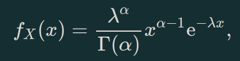
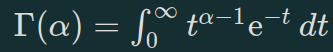

Função de densidade de probabilidade

Função Gama

Estimativas de máxima verosimilhança: α^ e λ^

α^ pode ser obtida numericamente por recurso à função uniroot do R. Use o intervalo [0.001, 169.8].

Determine a estimativa de máxima verosimilhança de (α−1)/λ com duas casas decimais.